# 💼 Job Portal System

A full-stack web-based Job Portal System that connects **Job Seekers, Recruiters, and Administrators** through a single platform.

The system allows recruiters to post job opportunities, administrators to manage and approve jobs, and job seekers to search for jobs and submit applications.

## 🚀 Features

### 👨‍💼 Job Seeker

* Register and login
* Browse available job opportunities
* Search jobs by location
* View complete job details
* Apply for jobs
* Add a cover letter
* View submitted applications
* Track application status
* Manage profile

### 🏢 Recruiter

* Recruiter registration and login
* Manage company information
* Post new job opportunities
* Select job type
* Add salary and required skills
* Set application deadline
* View posted jobs
* Manage jobs
* View applicants

### 🛡️ Administrator

* Secure admin login
* View dashboard statistics
* Manage users
* View pending jobs
* Approve or reject job postings
* Monitor jobs and applications

## 🏗️ Technology Stack

### Frontend

* React.js
* Vite
* React Router
* Axios
* HTML5
* CSS3

### Backend

* Node.js
* Express.js
* REST API
* JWT Authentication
* bcrypt

### Database

* MySQL
* Relational database
* Foreign key relationships

## 📁 Project Structure

```text
job-portal-system/
│
├── client/
│   ├── public/
│   └── src/
│       ├── components/
│       ├── pages/
│       │   ├── admin/
│       │   ├── jobs/
│       │   ├── jobseeker/
│       │   └── recruiter/
│       └── services/
│
├── server/
│   ├── config/
│   ├── controllers/
│   ├── middleware/
│   ├── routes/
│   └── server.js
│
├── database/
│   └── job_portal_db.sql
|
├── .gitignore
└── README.md
```

## 🗄️ Database

The project uses MySQL database:

```text
job_portal_db
```

Main tables:

* `users`
* `companies`
* `jobs`
* `applications`

### Database Relationships

```text
users
  │
  ├── companies
  │       │
  │       └── jobs
  │              │
  │              └── applications
  │
  └── applications
```

The complete database setup script is available at:

```text
database/job_portal_db.sql
```

## ⚙️ Installation

### 1. Clone the repository

```bash
git clone https://github.com/pojjuruhepsiba/job-portal-system.git
cd job-portal-system
```

### 2. Install frontend dependencies

```bash
cd client
npm install
```

### 3. Install backend dependencies

Open another terminal:

```bash
cd server
npm install
```

### 4. Configure environment variables

Create a `.env` file inside the `server` folder.

Example:

```env
PORT=5000
DB_HOST=localhost
DB_USER=root
DB_PASSWORD=YOUR_MYSQL_PASSWORD
DB_NAME=job_portal_db
JWT_SECRET=YOUR_SECRET_KEY
```

Do not upload `.env` to GitHub.

### 5. Setup MySQL

Open MySQL Workbench and execute:

```text
database/job_portal_db.sql
```

This creates the required database, tables, demo users, company, jobs, and application data.

## ▶️ Run the Application

### Start backend

```bash
cd server
npm start
```

Backend:

```text
http://localhost:5000
```

### Start frontend

Open another terminal:

```bash
cd client
npm run dev
```

Frontend:

```text
http://localhost:5173
```

## 🔐 Demo Accounts

### Administrator

```text
Email: admin@test.com
Password: 123456
Role: Admin
```

### Job Seeker

```text
Email: jobseeker@test.com
Password: 123456
Role: Job Seeker
```

### Recruiter

```text
Email: recruiter@test.com
Password: 123456
Role: Recruiter
```

## 🔄 Application Flow

```text
Job Seeker
    ↓
Login
    ↓
Browse Jobs
    ↓
View Job Details
    ↓
Apply for Job
    ↓
Application Stored
    ↓
Recruiter Views Applicant
```

## 🛡️ Security

The application includes:

* JWT-based authentication
* Role-based authorization
* Protected routes
* Password hashing
* Request validation
* MySQL foreign key constraints
* Environment variables for sensitive configuration

# 📸 Project Screenshots

## 🏠 Home Page


## 🏠 Home Page – Jobs View

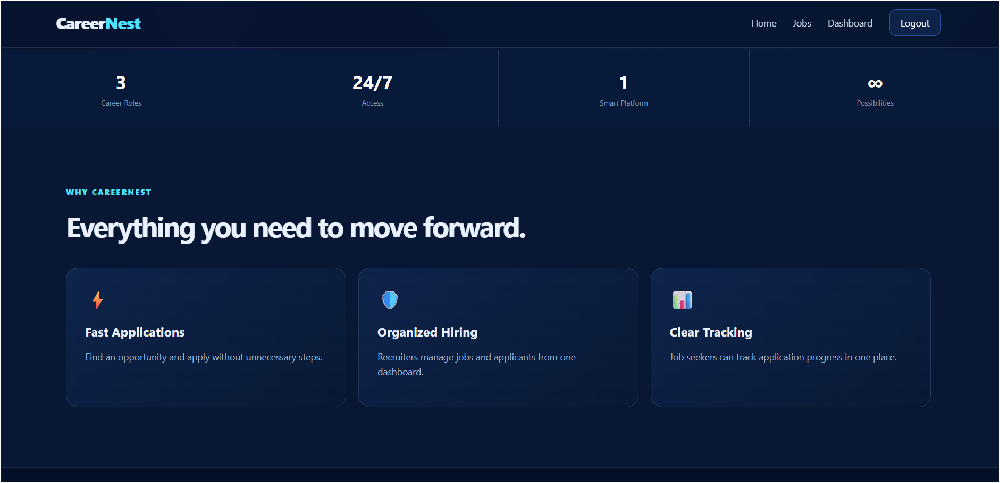

## 🏠 Home Page 

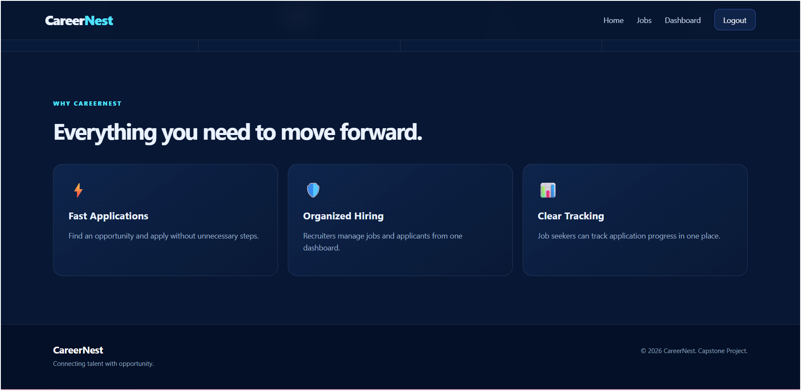

## 🔐 Login Page

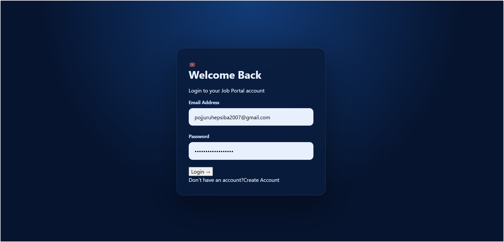

## 📝 Registration Page

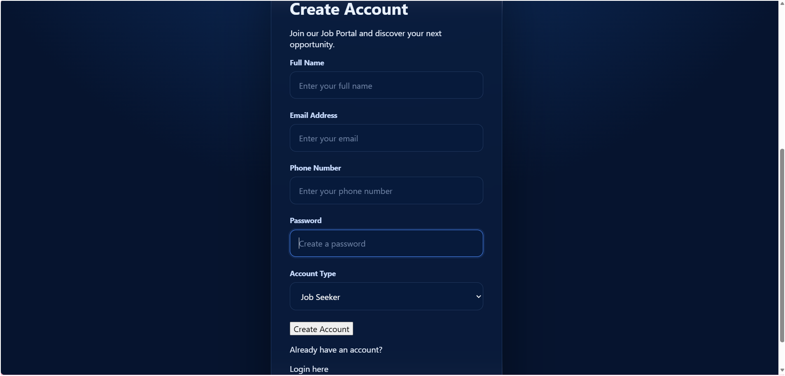

## 💼 Job Details

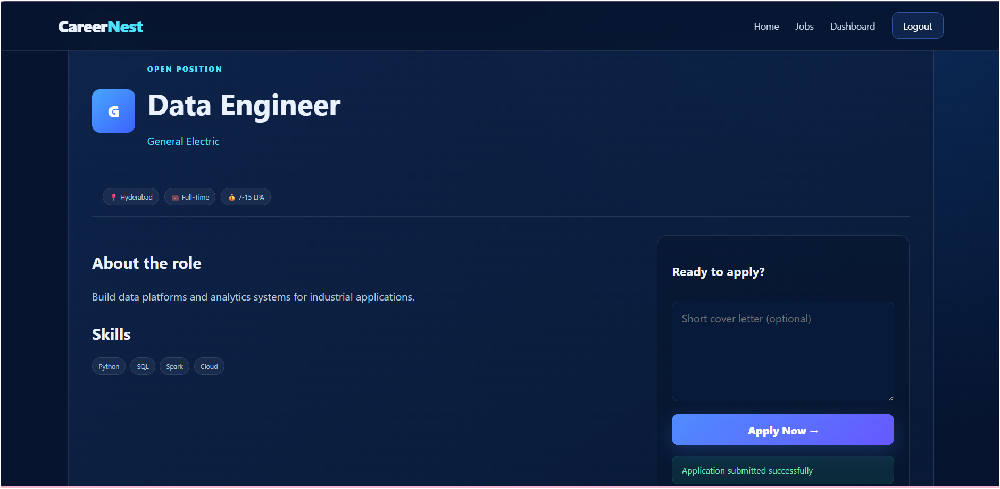

## 👨‍🎓 Job Seeker Dashboard

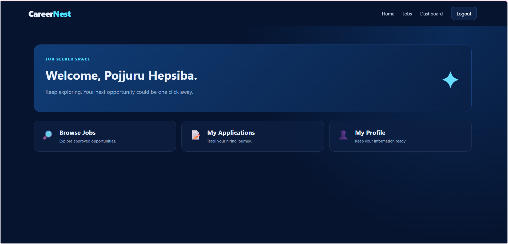

## 📋 My Applications

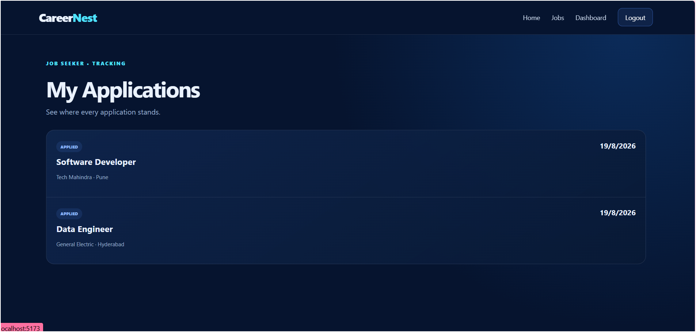

## 🏢 Company Profile

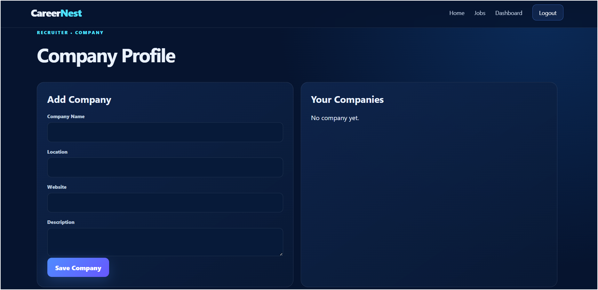 363

## 👔 Recruiter Dashboard

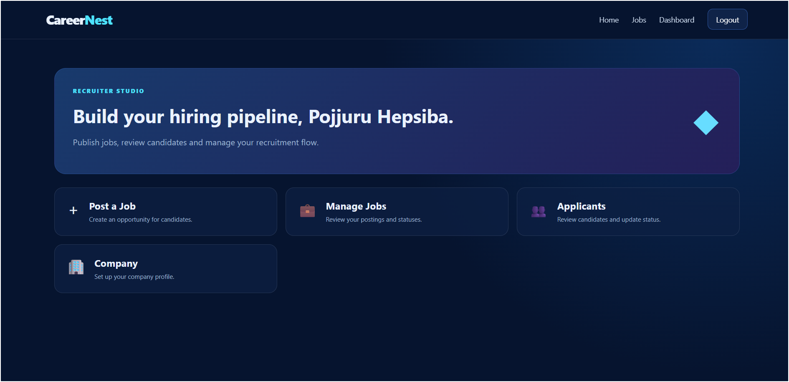

## ➕ Post Job

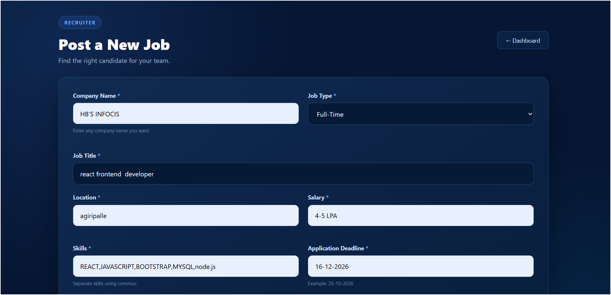

## 📝 Post Job Form

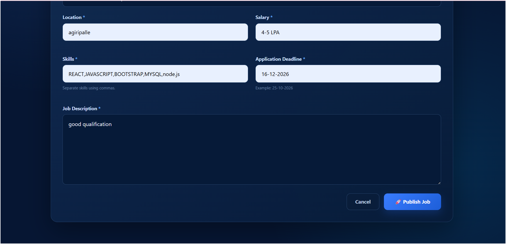

## 👥 Users Management

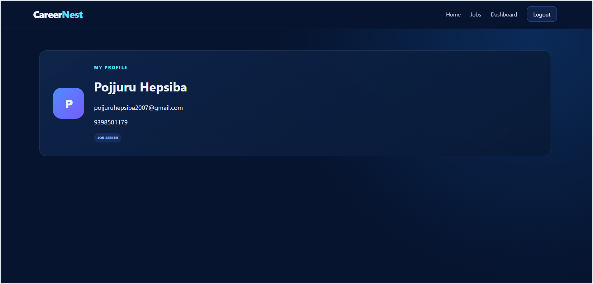


## 🎯 Project Objective

The objective of this project is to provide a centralized platform where job seekers can discover and apply for employment opportunities while recruiters can efficiently publish jobs and manage applicants. Administrators provide platform-level control through job and user management.

## 👩‍💻 Developer

**Pojjuru Hepsiba**

B.Tech Student

## 📌 Repository

GitHub:

https://github.com/pojjuruhepsiba/job-portal-system

## 📄 License

This project was developed as an academic capstone project.
